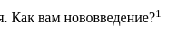

# HTML

## Понятие HTML

HTML  — это страндартизированный язык гипертекстовой разметки документов для просмотра веб страниц в браузере.

## Структура HTML документа

```
<!DOCTYPE html>
<html lang="en">
  <head>
    <meta charset="UTF-8" />
    <meta name="viewport" content="width=device-width, initial-scale=1.0" />
    <title>Document</title>
  </head>
  <body>
  </body>
</html>

```

1) <!DOCTYPE html> - предназначен для указания версии HTML

2) <html> — корневой элемент, который может содержать в себе <head> и <body>

3) <head> —  Метаданные документа и подключения

4) <title> — Заголовок документа

5) <body> — Отображаемое тело документа

6) Метатеги — это служеюные элементы кода, которые содержат информацию о странице

## Структура тега

На примере тега html

```jsx
<html lang="en">
```

— lang — атрибут

— en — свойство данного атрибута

## Что такое HTML5

HTML5 — это стандарт html, на данный момент HTML5 является последним стандартом для браузеров для отображения и взаимодействия с веб страницами.

## Теги <sup> и <sub>

<sup> — Предназначен для верстки текста в следующем формате:

```jsx
Как вам нововведение?<sup>1</sup>
```



<sub> — Предназначен для той же цели, только текст спозиционирован снизу

```jsx
Как вам нововведение?<sub>1</sub>
```


## Таблицы

Вот пример простой таблицы:

```jsx
<table border="1">
        <caption>Таблица расходов и доходов</caption>
        <thead>
            <tr>
                <th>Год</th>
                <th colspan="2">2023</th>
                <th colspan="2">2024</th>
            </tr>
            <tr>
                <th>Полугодие</th>
                <th>1</th>
                <th>2</th>
                <th>1</th>
                <th>2</th>
            </tr>
        </thead>
        <tbody>
            
            <tr>
                <td>Доход</td>
                <td>1500$</td>
                <td>1800$</td>
                <td>2000$</td>
                <td>3000$</td>
            </tr>
            <tr>
                <td>Расход</td>
                <td>-500$</td>
                <td>-600$</td>
                <td>-700$</td>
                <td>-1000$</td>
            </tr>
        </tbody>
        <tfoot>
            <tr>
                <td>Итого</td>
                <td>1000$</td>
                <td>1200$</td>
                <td>1300$</td>
                <td>2000$</td>
            </tr>
        </tfoot>
    </table>
```

1) <caption> — Описание таблицы, строго располагается сразу после открывающегося тега <table>, желательно всегда описывать, даже если в дизайне его нет, просто стилями скрываем и повышаем семантичность для людей со скрин ридерами

2) <thead> — Заголовки таблицы

3) <tr> — table row, то есть строка табоицы

4) <th> — Столбец в заголовке таблицы

5) <tbody> — Контент таблицы

6) <td> — Столбец в главном контенте таблицы

7) <tfoot> — Футер таблицы

8) colspan — количество занимаемых столбцов

9) rowspan — количество занимаемых строк 

## Radio

По своей специфике radio — это выбор лишь одного обязательного поля из группы, чтобы input type=’radio’ понимал, что он относится к какой-то группе — нужно указывать одинаковый name для определенной группы

```jsx
<label
        >Салам
        <input type="radio" name="lucky" value="Hello" />
      </label>
      <label
        >Салам_2
        <input type="radio" name="lucky" value="Hello_2" />
      </label>
```

В данном примере одинаковый name указывает на принадлежность к одной группе

## Select

```jsx
<select name="theme" >
            <option value="all">Все</option>
            <optgroup label="Темы">
                <option value="frontend">Frontend</option>
                <option value="backend">Backend</option>
                <option value="devops">DevOps</option>
            </optgroup>
        </select>
```

Помимо просто option, можно ещё добавить optgroup

## Вопрос со специфичностью

```jsx
<p class="sectionTextBlue sectionTextRed">
            Работая в офисе, удалённо или в гибридном формате, с Miro ваша
            команда может общаться, сотрудничать и совместно заниматься
            творчеством в одном пространстве, из любой точки мира.
          </p>
```

```jsx
.sectionTextRed {
  background-color: red;
}

.sectionTextBlue {
	background-color: blue;
  }

```

Какой цвет применится?

1…,2…,3…

Баааам, применится синий цвет


Все дело в том, что в каскадных стилях sectionTextBlue располагается ниже, соответственно применяется именно он, а не красный, здесь порядок объявления классов никак не влияет

## Единицы измерения em и rem

### Em

Em — единица измерения, которая задает размер относительно величины шрифта родителя, то есть если у <section> задан font-size: 16px, то применение на дочернем блоке 3em = 48px

Удобная величина, если дизайн прекрасен и меняется везде на адаптиве пропорционально, но тем не менее, в текущих реалиях такое встречается редко, поэтому наследование величины шрифта от родителя — это такая себе проблема

### Rem

Rem — единица измерения, которая задает размер относительно величины шрифта корневого html документа, по дефолту — это  16px, но это можно регулировать при помощи font-size у корневого элемента, чтобы 1rem был равен 10px можно написать вот так

```jsx
  font-size: 62.5%;
```

## Анимации

### Transition

```jsx
#heroButton {
	background-color: blue;
	color: white;
	padding: 20px;
	border-radius: 10px;
	border: none;
	font-size: 20px;
	transition: all 0.3s ease;
	cursor: pointer;
}

#heroButton:hover {
	background-color: darkblue;
	transform: scale(0.9);
}
#heroButton:focus {
	background-color: red;
	transform: translateX(200px);
}
```

Выше представлен простой пример анимации при наведении и выделении табуляцией кнопки

transition задается всегда на самом элементе, чтобы анимация была как при наведении, так и при потере наведения

Также можно избежать анимирования всего на кнопке и сделать анимации на различные свойства, пример:

```jsx
#heroButton {
	background-color: blue;
	color: white;
	padding: 20px;
	border-radius: 10px;
	border: none;
	font-size: 20px;
	transition: background-color 0.1s ease, transform 1s ease;;
	cursor: pointer;
}

#heroButton:hover {
	background-color: darkblue;
				}
#heroButton:focus {
	background-color: red;
	transform: translateX(200px);
}
```

В данных примерах ease — это transition-timing-function, в целом влияет на скорость анимации на различных этапах (быстрее в начале и медленнее ближе к концу или линейная скорость или наоборот медленнее в начале и быстрее в конце, анимация все равно выполнится за заданное время, влияет в общем на сам процесс преобразования )

### Animation

Пример: 

```jsx
@keyframes button-anim {
	0% {
		background-color: blue;
	}
	25% {
		background-color: green;
	}
	50% {
		background-color: red;
	}
	100% {
		background-color: blue;
	}
	
}

#heroButton {
	background-color: blue;
	color: white;
	padding: 20px;
	border-radius: 10px;
	border: none;
	font-size: 20px;
	cursor: pointer;
	animation: button-anim 2s infinite;

}
```

## Flexbox

### Различия align-items от align-content

align-items влияет на позиционирование строки элементов при flex-direction: row и flex-wrap: wrap, смотри пример ниже

```jsx
body {
    background-color: black;
}

.box {
    border: 1px solid purple;
    display: flex;
    height: 100vh;
    justify-content: space-between;
    flex-flow: row wrap;
}

.item {
    width: calc(100% / 4);
    color: white;
    border: 1px solid red;
    text-align: center;
    font-size: 20px;
    padding: 20px;
}
```


Теперь если классу .box добавить align-items: center, то элементы отцентруются относительно своей строки


Если же задать align-content: center, то 


## Grid

Очень важное свойство grid-template-columns

1) Обычно задается в fr

2) Примеры:

```css
  grid-template-columns: repeat(3, 1fr);
```

В данном примере наша сетка делится на три столбца, избыток переносится на новуют строку, будет выглядеть вот так:


```css
  grid-template-columns: repeat(3, 1fr) auto;

```

Свойство auto говорит о том, что размер 4-ой колонки будет подстраиваться под оставшуюся ширину, будет выглядеть вот так:


Далее рассмотрим как работает grid-template-rows, здесь важно понимать, что grid-template-rows очень сильно зависит от ограничения в высоте, поэтому важно, чтобы высота была ограниченной величиной, пример

 

```
.wrapper {
  display: grid;
  grid-template-columns: repeat(3, 1fr);
  grid-template-rows: 300px 200px;
}
```


Чтобы увеличить ширину конкретной колонки необходимо обратиться к свойству grid-column

```css
.wrapper {
  display: grid;
  grid-template-columns: repeat(4, 1fr);
}

.item_11 {
	grid-column: span 2;
}
```

В данном примере span обозначает на сколько колонке расстянуться (сколько ячеек нужно объединить)


Также можно откинуть верстку от начала и до конца при помощи названий линий

```css
.wrapper {
  display: grid;
  grid-template-columns: [start] repeat(4, 1fr) [end];
}

.item_11 {
	grid-column: start / end;
}
```


Адаптивный grid 

Если мы делаем адативную сетку, то можно воспользоваться свойством auto-fit или auto-fill в repeat

```css
.wrapper {
  display: grid;
  grid-template-columns: repeat(auto-fill, 300px);
}
```


Разница auto-fit и auto-fill выражается при наличии малого количества элементов в сетке 

auto-fill:


auto-fit:


Соответственно, при auto-fit не создает пустых колонок при условии того, что под неё есть место, а вот auto-fill как раз занимает и пустое пространство

```css
.wrapper {
  display: grid;
  grid-template-columns: repeat(auto-fill, 300px);
}

.item_4 {
  grid-column: auto / -1;
}
```

auto-fill 


auto-fit:

```css
.wrapper {
  display: grid;
  grid-template-columns: repeat(auto-fit, 300px);
}

.item_4 {
  grid-column: auto / -1;
}
```


  grid-column: auto / -1; — auto обозначает, что элемент начинается где угодно автоматически

Как сделать грид адаптивным?

Существует такая функция minmax(min, max)

```css
.wrapper {
  display: grid;
  grid-template-columns: repeat(auto-fill, minmax(150px, 1fr));
}
```

То есть колонка будет варьироваться в своих размерах от 150, до 1fr, когда колонка становится менее 150px, тогда происходит сокращения числа колонок


Если данную функцию использовать в связке с auto-fit, то получится иначе, наша сетка не будет генерировать пустые колонки, а будет расстягивать текущие на больших размерах, а при достижении <150px будет уменьшать число колонок

```css
.wrapper {
  display: grid;
  grid-template-columns: repeat(auto-fit, minmax(150px, 1fr));
}
```


Order

По умолчанию при создании адаптивной сетки order = 0, поэтому для задания правильного order элементам необходимо проставлять всем элементам order —  ЭТО ВАЖНО

```css
.wrapper {
  display: grid;
  grid-template-columns: repeat(auto-fit, minmax(150px, 1fr));
}

.item_1 {
	order: 1;
}
.item_2 {
	order: 2;
}
```


При помощи свойства grid-auto-flow можно заменить напрвление основной оси, но также существует свойство dense

```css
.grid-auto-flow: dense
```

Для понимания этого свойства рассмотрим такой пример:

```css
.wrapper {
  display: grid;
  grid-template-columns: repeat(3, 100px);
}

.item_3 {
	grid-column: 1 / -1;
}

.item_4 {
	grid-column: span 2;
}

.item_5 {
	grid-column: span 2;
}
```


Как видно из примера у нас образуются пустые пространства 

Так вот если применить свойство grid-auto-flow: dense, то мы заметим, что пустые пространства заполняются 

```css
.wrapper {
  display: grid;
  grid-template-columns: repeat(3, 100px);
  grid-auto-flow: dense;
}

.item_3 {
	grid-column: 1 / -1;
}

.item_4 {
	grid-column: span 2;
}

.item_5 {
	grid-column: span 2;
}
```


### grid-template-area

```css
.wrapper {
  display: grid;
  grid-template-areas: 
  "header header"
  "sidebar content"
  "footer footer";
  grid-gap: 30px;
  min-height: 93vh;
  grid-template-rows: auto 1fr auto;

}

.header {
  grid-area: header;
}
.sidebar {
  grid-area: sidebar;

}
.content {
  grid-area: content;

}
.footer {
  grid-area: footer;
}
```


grid-template-areas очень удобен при адаптиве, потому что нужно всего-лишь заданный порядок имен grid-area