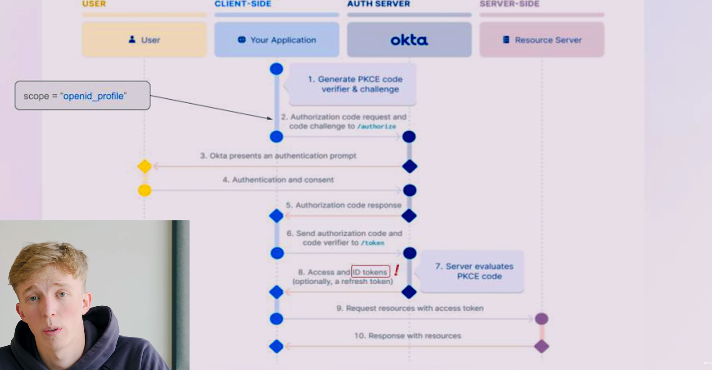

# OpenID Connect

## OpenID Connect (OIDC) — это протокол, который использует механизмы авторизации и аутентификации OAuth 2.0.

OIDC: 

— Надстройка над OAuth 2.0, добавляющая аутентификацию

— Добавляет ID Token - JWT с данными о пользователе

Небольшая вводная по поводу PKCE в схеме работы OIDC: 

— Создается два кода

- code verifier (замок)
- code challenge (ключ)

— Challenge отправляется на auth server при аутентификации пользователя на стороннем сервере (auth server)

— Когда наш сервис попытается получить токен,  то вместе с authorization code отправляется code verifier

— Auth сервер проверяет подходит ли code verifier к code challenge (подходит ли ключ к замку), если все ок, то возвращается ответ в виде access, refresh (optional) и id токенов

### Flow работы OIDC на примере okta

— Далее все шаги в целом такие же как и в OAuth 2.0, за исключением того, в ответе приходит ещё id token, который содержит информацию о пользователе, а ещё scope обязательно указывается в:

```jsx
scope = 'openid_profile'
```

— Сначала мы получаем для нашего сервиса clientID и clientSecret на стороне гугл и коннектим это все на программном уровне

— Генерируется PKCE код verifier & challenge ( Этот код нужен для того, чтобы добавить дополнительный слой защиты 
— Когда пользователь заходит на наш сервис через okta провайдер, то наш сервис отправляет запрос на Auth Server okta с query параметрами и challenge code

```jsx

redirect URI = "Наш сайт"
Response Type = 'code'
ClientID = Тот clientID, который мы получили от гугла
scope = 'openid_profile'
challenge code = 'что-то сюда'
```

``— На стороне Auth Сервера происходит аутентификация пользователя ( Пользователь вводит свои credentials от okta)
— Сервер возвращает нашему сервису Authorization Code
— При помощи Authorization Code, ClientID, Client Secret наш сервис делает запрос на authorization сервер, также добавляется verifier code
— Если challenge и verifier code’s подходят друг к другу, то сервер возвращает access token и refresh token (Опционально) и id token (ID token - содержит информацию о пользователе).
— Наш сервис отправляет запрос на получение нужных ему данных и прикручивает к запросу access токен
— Resource сервер возвращает ответ на наш сервис



