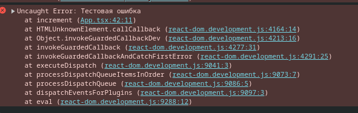

# Webpack

## Базовый webpack

Webpack - это инструмент сборки проектов, он используется в веб разработке для автоматизации процесса сборки и оптимизации кода. 

Чтобы начать работу с webpack необходимо установить зависимости

```jsx
npm i webpack webpack-cli --save-dev
```

### 1) Простейший конфиг

Данный конфиг работает для js файлов, index.html в данном примере отсутствует.

```jsx
const path = require("path");

module.exports = {
  entry: path.resolve(__dirname, "src", "index.js"), // Путь для точки входа в наше приложение, то есть главный index.js фай
  mode: "development", // Мод для сборки, бывают "production" | "development"
  output: {
    path: path.resolve(__dirname, "dist"), // Здесь указывается куда будет складываться сгенерированный файл
    filename: "[name].[contenthash].js", // Название сгенерированного файла. [name] - для динамической генерации названия, но самое главное уникальный [contenthash], если файл изменится, то contenthash тоже поменяется, отсюда решается проблема коллизий
    clean: true, // Удаляет старые файлы перед тем как туда положить новые
  },
};

```

### 2) Переменные окружения

Переменные окружения можно передать напрямую через скрипт в package.json

```jsx
"scripts": {
    "build:dev": "webpack --env mode=development",
    "build:prod": "webpack --env mode=production"
  },
```

Для того чтобы считать эти переменные окружения в самом webpack конфиге необходимо в module.exports возвращать не объект, а callback с аргументом для переменной окружения, который уже возвращает объект конфига

```jsx
const path = require("path");

module.exports = (env) => ({
  entry: path.resolve(__dirname, "src", "index.js"), // Путь для точки входа в наше приложение, то есть главный index.js файл
  mode: env.mode ?? "development", // Мод для сборки, бывают "production" | "development"
  output: {
    path: path.resolve(__dirname, "dist"), // Здесь указывается куда будет складываться сгенерированный файл
    filename: "[name].[contenthash].js", // Название сгенерированного файла. [name] - для динамической генерации названия, но самое главное уникальный [contenthash], если файл изменится, то contenthash тоже поменяется, отсюда решается проблема коллизий
    clean: true, // Удаляет старые файлы перед тем как туда положить новые
  },
});

```

### 3) Плагины и работа с HTML

Плагины работают на уровне всего бандла или чанка и выполняют свои действия после того как весь бандл был сгенерирован

```jsx
npm i html-webpack-plugin --save-dev
```

Вот так выглядит HTML файл, который находится в public/index.html

```jsx
<!DOCTYPE html>
<html lang="en">
<head>
    <meta charset="UTF-8">
    <meta name="viewport" content="width=device-width, initial-scale=1.0">
    <title>Document</title>
</head>
<body>
    <div id="root"></div>
</body>
</html>
```

Наша задача подставлять в этот html документ скрипты, которые компилируются в результате сборки, вот так это должно выглядеть после сборки 

```jsx
<!DOCTYPE html>
<html lang="en">
<head>
    <meta charset="UTF-8">
    <meta name="viewport" content="width=device-width, initial-scale=1.0">
    <title>Document</title>
</head>
<body>
    <div id="root"></div>
    <script src="../dist/main.05ca98710de1b6e0b38b.js"></script>
</body>
</html>
```

Вручную такую работу проделывать нельзя, ибо этим долэен заниматься HTMLWebpackPlugin, который будет автоматически выполнять эту работу

```jsx
const HtmlWebpackPlugin = require("html-webpack-plugin");
const path = require("path");

module.exports = (env) => ({
  entry: path.resolve(__dirname, "src", "index.js"), // Путь для точки входа в наше приложение, то есть главный index.js файл
  mode: env.mode ?? "development", // Мод для сборки, бывают "production" | "development"
  output: {
    path: path.resolve(__dirname, "build"), // Здесь указывается куда будет складываться сгенерированный файл
    filename: "[name].[contenthash].js", // Название сгенерированного файла. [name] - для динамической генерации названия, но самое главное уникальный [contenthash], если файл изменится, то contenthash тоже поменяется, отсюда решается проблема коллизий
    clean: true, // Удаляет старые файлы перед тем как туда положить новые
  },
  plugins: [
    // Данный плагин нужен для вставки скриптов в index.html документ
    new HtmlWebpackPlugin({
        template: path.resolve(__dirname, 'public', 'index.html') // Путь до index.html файла 
    })
  ]
});

```

Если не указать template, то этот плагин просто создаст пустой index.html файл и положит туда скрипт.

Сам index.html после компиляции выглядит следующим образом:

```html
<!DOCTYPE html>
<html lang="en">
<head>
    <meta charset="UTF-8">
    <meta name="viewport" content="width=device-width, initial-scale=1.0">
    <title>Document</title>
<script defer src="main.877d235ea5f2993ef3a9.js"></script></head>
<body>
    <div id="root"></div>
</body>
</html>
```

Как видно скрипт - defer, то есть он начинает загружать скрипт параллельно генерации dom дерева, но исполняет его только после того, как dom дерево будет полностью сгенерированно.

### 4) Loader. Настройка typescript.

Лоадеры - работают на уровне отдельных файлов и преобразуют их в такой формат, который может быть обработан при помощи webpack. Они используются для обработки различных файлов, например CSS, изображения, Typescript, и преобразования их в javascript, который может быть включен в итоговый бандл. Лоадеры выполняются ДО генерации бандла и работают с каждым файлом индивидуально.

Loaders в Webpack работают в цепочке, применяя трансформации к ресурсу последовательно. Порядок выполнения loaders определяется порядком их указания в конфигурации Webpack, и они выполняются в обратном порядке. Это означает, что первый loader в списке будет применяться последним, а последний loader в списке будет применяться первым.

```jsx
module: {
 rules: [
    {
      test: /\.css$/,
      use: ['style-loader', 'css-loader']
    }
 ]
}

```

В этом примере, `css-loader` будет применен первым, преобразуя CSS в JavaScript, а затем `style-loader` будет применен вторым, добавляя стили в DOM. Это происходит до генерации бандла, поскольку loaders обрабатывают и преобразуют файлы перед тем, как Webpack начнет генерацию бандла.

Теперь перейдем к практике:

Для начала необходимо установить зависимости: 

```jsx
npm install --save-dev typescript ts-loader
```

Далее небходимо определить tsconfig.json файл

```jsx
{
    "compilerOptions": {
      "outDir": "./dist/",
      "noImplicitAny": true,
      "module": "es6",
      "target": "es5",
      "jsx": "react",
      "allowJs": true,
      "moduleResolution": "node"
    }
  }
```

Модифицируем webpack.config 

```jsx
const HtmlWebpackPlugin = require("html-webpack-plugin");
const path = require("path");

module.exports = (env) => ({
  entry: path.resolve(__dirname, "src", "index.ts"), // Путь для точки входа в наше приложение, то есть главный index.js файл
  mode: env.mode ?? "development", // Мод для сборки, бывают "production" | "development"
  output: {
    path: path.resolve(__dirname, "build"), // Здесь указывается куда будет складываться сгенерированный файл
    filename: "[name].[contenthash].js", // Название сгенерированного файла. [name] - для динамической генерации названия, но самое главное уникальный [contenthash], если файл изменится, то contenthash тоже поменяется, отсюда решается проблема коллизий
    clean: true, // Удаляет старые файлы перед тем как туда положить новые
  },
  plugins: [
    // Данный плагин нужен для вставки скриптов в index.html документ
    new HtmlWebpackPlugin({
      template: path.resolve(__dirname, "public", "index.html"), // Путь до index.html файла
    }),
  ],
  module: {
    rules: [
      {
        test: /\.tsx?$/, // Формат расширения файла подходящий для этого loader
        use: "ts-loader", // Название лоадера для этой регулярки
        exclude: /node_modules/, // Файлы которые исключаем
      },
    ],
  },
  resolve: {
    extensions: [".tsx", ".ts", ".js"],  // Параметр, который позволяет не указывать расширения при исмпортах
  },
});

```

### 5) Перевод конфига webpack на typescript

Установим зависимости:

```jsx
npm install --save-dev typescript ts-node @types/node @types/webpack
```

Модификация tsconfig.json

```jsx
{
    "compilerOptions": {
      "outDir": "./dist/",
      "noImplicitAny": true,
      "module": "ESNext",
      "target": "es5",
      "jsx": "react",
      "allowJs": true,
      "moduleResolution": "node",
      // Если какая-то библиотека не имеет default import 
      // loader'ы вроде ts-loader или babel-loadaer автоматически создают их 
      // Вместо такого импорта import * as React from 'react'
      // Можно писать такой import React from 'react'
      "allowSyntheticDefaultImports": true,
      // esModuleInterop позволяет работать с пакетами, которые используют commonJS как с обычными пакетами с помощью import (require() module.export) = common js
      // import Momemnt from 'moment'
      // Без флага esModuleInterop результат undefined
      // console.log(Moment)
      // С флагом [object Object]
      // console.log(Moment)
      "esModuleInterop": true
    },
    "ts-node": {
      "compilerOptions": {
        "module": "CommonJS"
      }
    }
  }
```

Модификация webpack.config.ts

```jsx
import HtmlWebpackPlugin from "html-webpack-plugin";
import path from 'path';
import webpack from 'webpack';

type Mode = 'production' | 'development';

type EnvVariables = {
  mode: Mode
}

export default (env: EnvVariables) => {
  const config: webpack.Configuration = {
    entry: path.resolve(__dirname, "src", "index.ts"), // Путь для точки входа в наше приложение, то есть главный index.js файл
    mode: env.mode ?? "development", // Мод для сборки, бывают "production" | "development"
    output: {
      path: path.resolve(__dirname, "build"), // Здесь указывается куда будет складываться сгенерированный файл
      filename: "[name].[contenthash].js", // Название сгенерированного файла. [name] - для динамической генерации названия, но самое главное уникальный [contenthash], если файл изменится, то contenthash тоже поменяется, отсюда решается проблема коллизий
      clean: true, // Удаляет старые файлы перед тем как туда положить новые
    },
    plugins: [
      // Данный плагин нужен для вставки скриптов в index.html документ
      new HtmlWebpackPlugin({
        template: path.resolve(__dirname, "public", "index.html"), // Путь до index.html файла
      }),
    ],
    module: {
      rules: [
        {
          test: /\.tsx?$/, // Формат расширения файла подходящий для этого loader
          use: "ts-loader", // Название лоадера для этой регулярки
          exclude: /node_modules/, // Файлы которые исключаем
        },
      ],
    },
    resolve: {
      extensions: [".tsx", ".ts", ".js"],  // Параметр, который позволяет не указывать расширения при исмпортах
    },
  }
  return config
};

```

### 6) Dev server, Watch режим, Source Maps

Для начала установим зависимости для webpack-dev-server

```jsx
npm install --save-dev webpack-dev-server
npm install --save-dev @types/webpack-dev-server
```

После установки зависимостей необходимо подтянуть типы для того, чтобы devServer был типизирован в конфигурации, его необязательно даже присваивать

```jsx
import type { Configuration as DevServerConfiguration } from "webpack-dev-server";
```

Далее необходимо дополнить конфигурацию 

```jsx
import HtmlWebpackPlugin from "html-webpack-plugin";
import path from 'path';
import webpack from 'webpack';
import type { Configuration as DevServerConfiguration } from "webpack-dev-server";

type Mode = 'production' | 'development';

type EnvVariables = {
  mode: Mode,
  port: number
}

export default (env: EnvVariables) => {
  const config: webpack.Configuration = {
    entry: path.resolve(__dirname, "src", "index.ts"), // Путь для точки входа в наше приложение, то есть главный index.js файл
    mode: env.mode ?? "development", // Мод для сборки, бывают "production" | "development"
    output: {
      path: path.resolve(__dirname, "build"), // Здесь указывается куда будет складываться сгенерированный файл
      filename: "[name].[contenthash].js", // Название сгенерированного файла. [name] - для динамической генерации названия, но самое главное уникальный [contenthash], если файл изменится, то contenthash тоже поменяется, отсюда решается проблема коллизий
      clean: true, // Удаляет старые файлы перед тем как туда положить новые
    },
    plugins: [
      // Данный плагин нужен для вставки скриптов в index.html документ
      new HtmlWebpackPlugin({
        template: path.resolve(__dirname, "public", "index.html"), // Путь до index.html файла
      }),
    ],
    module: {
      rules: [
        {
          test: /\.tsx?$/, // Формат расширения файла подходящий для этого loader
          use: "ts-loader", // Название лоадера для этой регулярки
          exclude: /node_modules/, // Файлы которые исключаем
        },
      ],
    },
    resolve: {
      extensions: [".tsx", ".ts", ".js"],  // Параметр, который позволяет не указывать расширения при исмпортах
    },
    devServer: {
      port: env.port ?? 3000, // Порт на котором будет запускаться devServer
      open: true, // Необходим для автоматического открытия браузера
    }
  }
  return config
};

```

Далее в package.json добавляем новый скрипт

```jsx
"start": "webpack serve",
```

Теперь прописав команду 

```jsx
npm run start 
```

У нас запускается dev server.

Если мы хотим передать какие-то env переменные прямо при прописании команды, то это необходимо сделать следующим образом: 

```jsx
npm run start -- --env port=5000
```

Чтобы облегчить процесс запуска вынесем это в скрипт в package.json

```jsx
"start": "webpack serve --env mode=development",
```

**SouceMap** - используется для удобной отладки кода. Это все обсуславливается тем, что без него получается, что весь js код может находиться в одном бандле и невозможно отследить из какого файла возникла ошибка.

Данное замечание особенно отражается в режиме develop при запущенном dev server

При выключенном source-map: 



Переходим к ошибке и видим такой код


Теперь включим данный devtool


Как видно на примере - теперь отображается исходный код

```jsx
    devtool: 'inline-source-map', // Данный параметр помогает отслеживать ошибки, а именно в каком файле произошла ошибка

```

Данных souce-map’ов очень много, у них все основные характеристики: 

1) Скорость первоначального билда

2) Скорость ребилда

Какие-то из них отлично подходят для продакшн сборки, какие-то для дев сборки

Результирующий файл webpack.config.ts

```jsx
import HtmlWebpackPlugin from "html-webpack-plugin";
import path from 'path';
import webpack from 'webpack';
import type { Configuration as DevServerConfiguration } from "webpack-dev-server";

type Mode = 'production' | 'development';

type EnvVariables = {
  mode: Mode,
  port: number
}

export default (env: EnvVariables) => {
  const isDev = env.mode === 'development'
  const config: webpack.Configuration = {
    entry: path.resolve(__dirname, "src", "index.ts"), // Путь для точки входа в наше приложение, то есть главный index.js файл
    mode: env.mode ?? "development", // Мод для сборки, бывают "production" | "development"
    output: {
      path: path.resolve(__dirname, "build"), // Здесь указывается куда будет складываться сгенерированный файл
      filename: "[name].[contenthash].js", // Название сгенерированного файла. [name] - для динамической генерации названия, но самое главное уникальный [contenthash], если файл изменится, то contenthash тоже поменяется, отсюда решается проблема коллизий
      clean: true, // Удаляет старые файлы перед тем как туда положить новые
    },
    plugins: [
      // Данный плагин нужен для вставки скриптов в index.html документ
      new HtmlWebpackPlugin({
        template: path.resolve(__dirname, "public", "index.html"), // Путь до index.html файла
      }),
    ],
    module: {
      rules: [
        {
          test: /\.tsx?$/, // Формат расширения файла подходящий для этого loader
          use: "ts-loader", // Название лоадера для этой регулярки
          exclude: /node_modules/, // Файлы которые исключаем
        },
      ],
    },
    resolve: {
      extensions: [".tsx", ".ts", ".js"],  // Параметр, который позволяет не указывать расширения при исмпортах
    },
    devtool: isDev ? 'inline-source-map': false, // Данный параметр помогает отслеживать ошибки, а именно в каком файле произошла ошибка
    devServer: isDev ? {
      port: env.port ?? 3000, // Порт на котором будет запускаться devServer
      open: true, // Необходим для автоматического открытия браузера
    } : undefined
  }
  return config
};

```

### 7) React, JSX

Для начала установим зависимости

```jsx
npm i react react-dom
npm i @types/react @types/react-dom --save-dev
```

Сразу же важное замечание: 

**Если бы на проекте не было бы ts, то не было бы и ts-loader, а значит нам потребовался бы babel-loader. Именно поэтому нам не нужно ничего настраивать в webpack.config.ts для работы самого react.**

Меняем в tsconfig.json

```jsx
"jsx": "react-jsx",

```

Создаем index.tsx файл

```jsx
import { createRoot } from "react-dom/client";
import { App } from "./components/App";

const root = document.getElementById("root");

if (!root) {
  throw new Error("root not found");
}

const container = createRoot(root);

container.render(<App />);

```

Меняем entry в webpack.config.ts

```jsx
    entry: path.resolve(__dirname, "src", "index.tsx"), // Путь для точки входа в наше приложение, то есть главный index.js файл
```

### 8) Работа со стилями css и scss

Установим зависимости

```jsx
npm install --save-dev css-loader style-loader
```

Дополним наш webpack.config.ts

```jsx
  {
		  test: /\.css$/i,
		  use: ["style-loader", "css-loader"],
  },
```

Теперь для файлов с расширением css все работает

**Добавим поддержку scss:** 

Установим зависимости

```jsx
npm install sass-loader sass --save-dev
```

В конфиге добавим loader: 

```jsx
 {
          test: /\.s[ac]ss$/i,
          use: [
            // Creates `style` nodes from JS strings
            "style-loader",
            // Translates CSS into CommonJS
            "css-loader",
            // Compiles Sass to CSS
            "sass-loader",
          ],
 },
```

Но стоит помнить, что если оставить только последний loader, то файлы с расширением .css мы считывать не сможем, поэтому если есть такой кейс, то нужно добавить ещё loader для css, как было указано в начале этого пункта.

### 9) MiniCssExtractPlugin

Установим зависимости

```jsx
npm install --save-dev mini-css-extract-plugin
```

Без этого плагина получается так, что все стили встраиваются в итоговый js файл, этот плагин предназначен для того, чтобы можно было распределять стили в минифицированный css файл

Для этого нужно немного доработать webpack.config.ts, вместо style-loader нужно использовать MiniCssExtractPlugin.loader, а также инициализировать сам plugin, итоговый webpack.config.ts выглядит следующим образом:

```jsx
import HtmlWebpackPlugin from "html-webpack-plugin";
import path from "path";
import webpack from "webpack";
import MiniCssExtractPlugin from "mini-css-extract-plugin";
import type { Configuration as DevServerConfiguration } from "webpack-dev-server";

type Mode = "production" | "development";

type EnvVariables = {
  mode: Mode;
  port: number;
};

export default (env: EnvVariables) => {
  const isDev = env.mode === "development";
  const config: webpack.Configuration = {
    entry: path.resolve(__dirname, "src", "index.tsx"), // Путь для точки входа в наше приложение, то есть главный index.js файл
    mode: env.mode ?? "development", // Мод для сборки, бывают "production" | "development"
    output: {
      path: path.resolve(__dirname, "build"), // Здесь указывается куда будет складываться сгенерированный файл
      filename: "[name].[contenthash].js", // Название сгенерированного файла. [name] - для динамической генерации названия, но самое главное уникальный [contenthash], если файл изменится, то contenthash тоже поменяется, отсюда решается проблема коллизий
      clean: true, // Удаляет старые файлы перед тем как туда положить новые
    },
    plugins: [
      // Данный плагин нужен для вставки скриптов в index.html документ
      new HtmlWebpackPlugin({
        template: path.resolve(__dirname, "public", "index.html"), // Путь до index.html файла
      }),
      !isDev &&
        new MiniCssExtractPlugin({
          filename: "css/[name].[contenthash:8].css", // Название файла, чтобы не было коллизий
          chunkFilename: "css/[name].[contenthash:8].css", // Название чанка
        }),
    ],
    module: {
      rules: [
        {
          test: /\.s[ac]ss$/i,
          use: [
            isDev ? "style-loader" : MiniCssExtractPlugin.loader,
            // Translates CSS into CommonJS
            "css-loader",
            // Compiles Sass to CSS
            "sass-loader",
          ],
        },
        {
          test: /\.css$/i, // Добавлено правило для обработки CSS файлов
          use: ["style-loader", "css-loader"],
        },
        {
          test: /\.tsx?$/, // Формат расширения файла подходящий для этого loader
          use: "ts-loader", // Название лоадера для этой регулярки
          exclude: /node_modules/, // Файлы которые исключаем
        },
      ],
    },
    resolve: {
      extensions: [".tsx", ".ts", ".js"], // Параметр, который позволяет не указывать расширения при исмпортах
    },
    devtool: isDev ? "inline-source-map" : false, // Данный параметр помогает отслеживать ошибки, а именно в каком файле произошла ошибка
    devServer: isDev
      ? {
          port: env.port ?? 3000, // Порт на котором будет запускаться devServer
          open: true, // Необходим для автоматического открытия браузера
        }
      : undefined,
  };
  return config;
};

```

### 10) Декомпозиция конфига

Чтобы webpack.config.ts был читаемым можно распределить каждую составляющую в различные функции. Распределение будет выглядеть следующим образом

buildWebpack.ts

```jsx
import webpack from "webpack";
import { buildDevServer } from "./buildDevServer";
import { buildLoaders } from "./buildLoaders";
import { buildPlugins } from "./buildPlugins";
import { buildResolvers } from "./buildResolvers";
import { IOptions } from "./types/types";

export function buildWebpack(options: IOptions): webpack.Configuration {
  const { mode, paths } = options;
  const isDev = mode === "development";

  return {
    entry: paths.entry, // Путь для точки входа в наше приложение, то есть главный index.js файл
    mode: mode, // Мод для сборки, бывают "production" | "development"
    output: {
      path: paths.output, // Здесь указывается куда будет складываться сгенерированный файл
      filename: "[name].[contenthash].js", // Название сгенерированного файла. [name] - для динамической генерации названия, но самое главное уникальный [contenthash], если файл изменится, то contenthash тоже поменяется, отсюда решается проблема коллизий
      clean: true, // Удаляет старые файлы перед тем как туда положить новые
    },
    plugins: buildPlugins(options),
    module: {
      rules: buildLoaders(options),
    },
    resolve: buildResolvers(),
    devtool: isDev ? "inline-source-map" : false, // Данный параметр помогает отслеживать ошибки, а именно в каком файле произошла ошибка
    devServer: isDev ? buildDevServer(options) : undefined,
  };
}

```

buildDevServer.ts

```jsx
import type { Configuration as DevServerConfiguration } from "webpack-dev-server";
import { IOptions } from "./types/types";

export function buildDevServer({ port }: IOptions): DevServerConfiguration {
  return {
    port: port, // Порт на котором будет запускаться devServer
    open: true, // Необходим для автоматического открытия браузера
  };
}

```

buildLoaders.ts

```jsx
import MiniCssExtractPlugin from "mini-css-extract-plugin";
import { ModuleOptions } from "webpack";
import { IOptions } from "./types/types";

export function buildLoaders(options: IOptions): ModuleOptions["rules"] {
  const isDev = options.mode === "development";

  const scssLoader = {
    test: /\.s[ac]ss$/i,
    use: [
      isDev ? "style-loader" : MiniCssExtractPlugin.loader,
      // Translates CSS into CommonJS
      "css-loader",
      // Compiles Sass to CSS
      "sass-loader",
    ],
  };

  const tsLoader = {
    test: /\.tsx?$/, // Формат расширения файла подходящий для этого loader
    use: "ts-loader", // Название лоадера для этой регулярки
    exclude: /node_modules/, // Файлы которые исключаем
  };

  return [scssLoader, tsLoader];
}

```

buildPlugins.ts

```jsx
import HtmlWebpackPlugin from "html-webpack-plugin";
import MiniCssExtractPlugin from "mini-css-extract-plugin";
import { Configuration } from "webpack";
import { IOptions } from "./types/types";

export function buildPlugins({
  mode,
  paths,
}: IOptions): Configuration["plugins"] {
  const isProd = mode === "production";

  const plugins: Configuration["plugins"] = [
    new HtmlWebpackPlugin({
      template: paths.html, // Путь до index.html файла
    }),
  ];

  if (isProd) {
    plugins.push(
      new MiniCssExtractPlugin({
        filename: "css/[name].[contenthash:8].css", // Название файла, чтобы не было коллизий
        chunkFilename: "css/[name].[contenthash:8].css", // Название чанка
      })
    );
  }
  return plugins;
}

```

buildResolvers.ts

```jsx
import { Configuration } from "webpack";

export function buildResolvers(): Configuration['resolve'] {
    return {
        extensions: [".tsx", ".ts", ".js"], // Параметр, который позволяет не указывать расширения при исмпортах
    }
}
```

types.ts

```jsx
export type IBuildPaths = {
    entry: string;
    html: string;
    output: string;
}

export type IBuildMode = "production" | "development";

export type IEnvVariables = {
    mode: IBuildMode;
    port: number;
  };

export type IOptions = {
    port: number;
    paths: IBuildPaths;
    mode: IBuildMode;
}
```

webpack.config.ts

```jsx
import path from "path";
import webpack from "webpack";
import { buildWebpack } from "./config/build/buildWebpack";
import { IBuildPaths, IEnvVariables } from "./config/build/types/types";

export default (env: IEnvVariables) => {
  const paths: IBuildPaths = {
    entry: path.resolve(__dirname, "src", "index.tsx"),
    html: path.resolve(__dirname, "public", "index.html"),
    output: path.resolve(__dirname, "build"),
  };

  const config: webpack.Configuration = buildWebpack({
    mode: env.mode ?? "development",
    port: env.port ?? 3000,
    paths,
  });
  return config;
};

```

Такая декомпозиция может показаться избыточной, но при дальнейшей конфигурации webpack.config.ts будет просто нечитаемым, поэтому так будет в любом случае удобнее конфигурировать

### 11) Изоляция стилей. CSS Modules

Изначально Css модули требуют от typescript глобальной инициализации типа 

src/global.d.ts

```jsx
 declare module '*.scss' {
    interface IClassNames {
      [className: string]: string
    }
    const classNames: IClassNames;
    export = classNames;
  }
```

Далее конкретно у меня в проекте не работают css модули по дефолту, поэтому необходимо в css loader добавить следующий код

```jsx
 const cssLoaderWithModules = {
    loader: "css-loader",
    options: {
      esModule: false, // Добавляем это свойство для того, чтобы дефолтный импорт работал import classname from './что-то/Что-то.module.scss'
      modules: {
        auto: (resPath: string) => Boolean(resPath.includes(".module.")), // Добавляем этот параметр для того, чтобы обычные стили по типу New.scss работали и применялись, если так не сделать, cssLoader будет просто выполнять преобразования и классы не будут применяться
        localIdentName: isDev ? "[path][name]__[local]" : "[hash:base64:8]",
      },
    },
  };
```

В итоге код выглядит loader’ов следующим образом:

```jsx
import MiniCssExtractPlugin from "mini-css-extract-plugin";
import { ModuleOptions } from "webpack";
import { IOptions } from "./types/types";

export function buildLoaders(options: IOptions): ModuleOptions["rules"] {
  const isDev = options.mode === "development";

  const cssLoaderWithModules = {
    loader: "css-loader",
    options: {
      esModule: false, // Добавляем это свойство для того, чтобы дефолтный импорт работал import classname from './что-то/Что-то.module.scss'
      modules: {
        auto: (resPath: string) => Boolean(resPath.includes(".module.")), // Добавляем этот параметр для того, чтобы обычные стили по типу New.scss работали и применялись, если так не сделать, cssLoader будет просто выполнять преобразования и классы не будут применяться
        localIdentName: isDev ? "[path][name]__[local]" : "[hash:base64:8]",
      },
    },
  };

  const scssLoader = {
    test: /\.s[ac]ss$/i,
    use: [
      isDev ? "style-loader" : MiniCssExtractPlugin.loader,
      cssLoaderWithModules,
      "sass-loader",
    ],
  };

  const tsLoader = {
    test: /\.tsx?$/, // Формат расширения файла подходящий для этого loader
    use: "ts-loader", // Название лоадера для этой регулярки
    exclude: /node_modules/, // Файлы которые исключаем
  };

  return [scssLoader, tsLoader];
}

```

esModule: false - как выше указано позволяет добавить дефолтные импорты 

auto - проверяет, что обрабатываемый файл содержит .module. , что позволяет также работать и файлам по типу New.scss, чтобы глобальные стили для классов применялись

### 12) Роутинг, ленивые загрузки, Code splitting, Размер бандла, Bundle Analyzer, Hestory Api Fallback

Установим зависимости

```jsx
npm i react-router-dom
```

Далее инициализируем роутер 

```jsx
import { createRoot } from "react-dom/client";
import { App } from "./components/App";
import { RouterProvider, createBrowserRouter } from "react-router-dom";

const root = document.getElementById("root");

if (!root) {
  throw new Error("root not found");
}

const container = createRoot(root);

const router = createBrowserRouter([
  {
    path: '/',
    element: <App />,
    children: [
      {
        path: '/about',
        element: <h1>About</h1>
      },
      {
        path: '/shop',
        element: <h1>Shop</h1>
      },
    ]
  }
])

container.render(<RouterProvider router={router} />);

```

Код App.tsx 

```jsx
import { useState } from "react";

import classes from "./App.module.scss";
import "./New.scss";
import { Link, Outlet } from "react-router-dom";

export const App = () => {
  const [count, setCount] = useState<number>(0);

  const increment = () => {
    setCount((prev) => prev + 1);
  };
  return (
    <div>
      <nav>
        <Link to="/about">About</Link>
        <Link to="/shop">Shop</Link>
      </nav>
      <h1 className="hello">{count}</h1>
      <button className={classes.button} onClick={increment}>
        Inc
      </button>
      <Outlet />
    </div>
  );
};

```

Далее вот тут такая загвоздка получается, когда мы запускаем дев сервер, то получается так, что переходы вот по таким ссылкам работают 

```jsx
<nav>
    <Link to="/about">About</Link>
    <Link to="/shop">Shop</Link>
</nav>
```

А вот переходы при вводе адреса в браузерную строку не работают от слова совсем.

Для их работы следует добавить следующую конфигурацию

```jsx
import type { Configuration as DevServerConfiguration } from "webpack-dev-server";
import { IOptions } from "./types/types";

export function buildDevServer({ port }: IOptions): DevServerConfiguration {
  return {
    port: port, // Порт на котором будет запускаться devServer
    open: true, // Необходим для автоматического открытия браузера
    historyApiFallback: true,
  };
}

```

Опция `historyApiFallback` в конфигурации `devServer` Webpack используется для обеспечения корректной работы одностраничных приложений (SPA), использующих HTML5 History API. Когда пользователь переходит по ссылкам внутри вашего приложения, браузер делает запрос к серверу для каждой ссылки. Если сервер не настроен на обработку маршрутов, определенных на клиенте, он вернет ошибку 404.

**Ленивая подгрузка.**

Какой-то дополнительной настройки самого вебпака не требуется для деления бандла на чанки, это все реализуется стандартными средствами lazyLoading. 

Пример /about

About.tsx

```jsx
import React from "react";

const About = () => {
  return <div>About</div>;
};

export default About

```

About.lazy.tsx

```jsx
import { lazy } from "react";

export const LazyAbout = lazy(() => import('./About'))
```

Точка входа About

```jsx
export { LazyAbout as default } from "./About.lazy";

```

Использование в роутере

```jsx
import { createRoot } from "react-dom/client";
import { App } from "./components/App";
import { RouterProvider, createBrowserRouter } from "react-router-dom";
import { Suspense } from "react";
import LazyAbout from "./pages/About";
import LazyShop from "./pages/Shop";

const root = document.getElementById("root");

if (!root) {
  throw new Error("root not found");
}

const container = createRoot(root);

const router = createBrowserRouter([
  {
    path: "/",
    element: <App />,
    children: [
      {
        path: "/about",
        element: (
          <Suspense fallback={"loading..."}>
            <LazyAbout />
          </Suspense>
        ),
      },
      {
        path: "/shop",
        element: (
          <Suspense fallback={"loading..."}>
            <LazyShop />
          </Suspense>
        ),
      },
    ],
  },
]);

container.render(<RouterProvider router={router} />);

```

Анализ бандла

Установим зависимости 

```jsx
npm install --save-dev webpack-bundle-analyzer
npm install --save-dev @types/webpack-bundle-analyzer
```

Далее просто добавляем его в список плагинов

```jsx
import HtmlWebpackPlugin from "html-webpack-plugin";
import MiniCssExtractPlugin from "mini-css-extract-plugin";
import { Configuration } from "webpack";
import { IOptions } from "./types/types";
import { BundleAnalyzerPlugin } from "webpack-bundle-analyzer";

export function buildPlugins({
  mode,
  paths,
}: IOptions): Configuration["plugins"] {
  const isProd = mode === "production";

  const plugins: Configuration["plugins"] = [
    new HtmlWebpackPlugin({
      template: paths.html, // Путь до index.html файла
    }),
  ];

  if (isProd) {
    plugins.push(
      new MiniCssExtractPlugin({
        filename: "css/[name].[contenthash:8].css", // Название файла, чтобы не было коллизий
        chunkFilename: "css/[name].[contenthash:8].css", // Название чанка
      }),
      new BundleAnalyzerPlugin()
    );
  }

  return plugins;
}

```

Но чтобы analyzer не запускался при каждом билде сделаем следующие действия:

types.ts

```jsx
export type IBuildPaths = {
  entry: string;
  html: string;
  output: string;
};

export type IBuildMode = "production" | "development";

export type IEnvVariables = {
  mode: IBuildMode;
  port: number;
  analyzer?: boolean;
};

export type IOptions = {
  port: number;
  paths: IBuildPaths;
  mode: IBuildMode;
  analyzer?: boolean;
};

```

buildPlugins.ts

```jsx
import HtmlWebpackPlugin from "html-webpack-plugin";
import MiniCssExtractPlugin from "mini-css-extract-plugin";
import { Configuration } from "webpack";
import { IOptions } from "./types/types";
import { BundleAnalyzerPlugin } from "webpack-bundle-analyzer";

export function buildPlugins({
  mode,
  paths,
  analyzer,
}: IOptions): Configuration["plugins"] {
  const isProd = mode === "production";

  const plugins: Configuration["plugins"] = [
    new HtmlWebpackPlugin({
      template: paths.html, // Путь до index.html файла
    }),
  ];

  if (isProd) {
    plugins.push(
      new MiniCssExtractPlugin({
        filename: "css/[name].[contenthash:8].css", // Название файла, чтобы не было коллизий
        chunkFilename: "css/[name].[contenthash:8].css", // Название чанка
      })
    );
  }

  if (analyzer) {
    plugins.push(new BundleAnalyzerPlugin());
  }

  return plugins;
}

```

webpack.config.ts

```jsx
import path from "path";
import webpack from "webpack";
import { buildWebpack } from "./config/build/buildWebpack";
import { IBuildPaths, IEnvVariables } from "./config/build/types/types";

export default (env: IEnvVariables) => {
  const paths: IBuildPaths = {
    entry: path.resolve(__dirname, "src", "index.tsx"),
    html: path.resolve(__dirname, "public", "index.html"),
    output: path.resolve(__dirname, "build"),
  };

  const config: webpack.Configuration = buildWebpack({
    mode: env.mode ?? "development",
    port: env.port ?? 3000,
    analyzer: env.analyzer ?? false,
    paths,
  });
  return config;
};

```

package.json

```jsx
"scripts": {
    "start": "webpack serve --env mode=development",
    "build:dev": "webpack --env mode=development",
    "build:prod": "webpack --env mode=production",
    "build:prod:analyze": "webpack --env mode=production analyzer=true"
  },
```

### 13) Абсолютные пути (Alias)

Для создания абсолютных путей нужно выполнить два действия 

1)  Прописать в webpack resolvers параметр alias

```jsx
import { Configuration } from "webpack";
import { IOptions } from "./types/types";

export function buildResolvers(options: IOptions): Configuration['resolve'] {
    return {
        extensions: [".tsx", ".ts", ".js"], // Параметр, который позволяет не указывать расширения при исмпортах
        alias: {
            '@': options.paths.src
        }
    }
}
```

2) Доработать tsconfig

```jsx
"baseUrl": ".",
"paths": {
  "@/*": ["./src/*"]
}
```

Полный код tsConfig.ts

```jsx
{
  "compilerOptions": {
    "outDir": "./dist/",
    "noImplicitAny": true,
    "module": "ESNext",
    "target": "es5",
    "jsx": "react-jsx",
    "allowJs": true,
    "moduleResolution": "node",
    // Если какая-то библиотека не имеет default import
    // loader'ы вроде ts-loader или babel-loadaer автоматически создают их
    // Вместо такого импорта import * as React from 'react'
    // Можно писать такой import React from 'react'
    "allowSyntheticDefaultImports": true,
    // esModuleInterop позволяет работать с пакетами, которые используют commonJS как с обычными пакетами с помощью import (require() module.export) = common js
    // import Momemnt from 'moment'
    // Без флага esModuleInterop результат undefined
    // console.log(Moment)
    // С флагом [object Object]
    // console.log(Moment)
    "esModuleInterop": true,
    "baseUrl": ".",
    "paths": {
      "@/*": ["./src/*"]
    }
  },
  "ts-node": {
    "compilerOptions": {
      "module": "CommonJS"
    }
  }
}

```

### 14) Работа с картинками

Для того, чтобы картинки всех типов кроме svg работали корректно, то нужно прописать следующий loader: 

```jsx
 const assetLoader = {
    test: /\.(png|jpg|jpeg|gif)$/i,
    type: "asset/resource",
  };
```

Также для того, чтобы ts перестал ругаться нужно прописать в global.d.ts

```jsx
declare module '*.png'
declare module '*.jpg'
declare module '*.jpeg'
```

Чтобы работали svg:

Устанивливаем svgr

```jsx
npm install @svgr/webpack --save-dev
```

Прописываем loader

```jsx
const svgLoader = {
    test: /\.svg$/i,
    issuer: /\.[jt]sx?$/,
    use: [
      {
        loader: "@svgr/webpack",
        options: {
          icon: true, // данный параметр нужен для того, чтобы работать с размерами свг напрямую, а не с размером контейнера, в котором находится svg
          // Данная цепочка нужна для того, чтобы цвет svg можно было менять напрямую
          svgoConfig: {
            plugins: [
              {
                name: "convertColors",
                params: {
                  currentColor: true,
                },
              },
            ],
          },
        },
      },
    ],
  };
```

Прописываем типы 

```jsx
declare module "*.svg" {
    import React from "react";
    const SVG: React.VFC<React.SVGProps<SVGSVGElement>>;
    export default SVG;
}
```

### 15) Переменные сборки

Переменные сборки передаются при помощи DefinePlugin

```jsx
new DefinePlugin({
  __PLATFORM__: JSON.stringify(platform),
})
```

Чтобы ts не ругался типизируем в global.d.ts

```jsx
declare const __PLATFORM__: "desktop" | "mobile";

```

Вообще они нужны в основном для отображения dev или prod режима, например при запуске дев сервера можно автоматически передавать mode=’development’ и отображать какие-нибудь devTools

Почему вообще стоит их использовать?

Когда мы делаем условный рендеринг, то при сборке у нас все равно остается невыполненное условие, если же мы делим prod и dev при помощи переменных окружения, то то условие, которое не выполняется НЕ БУДЕТ ВКЛЮЧЕНО В СБИЛЖЕННЫЙ ФАЙЛ, а значит таким образом при помощи таких переменных можно спокойно воспроизводить условный рендеринг без вреда для продакшн сборки.

Такое поведение, кстати, называют Tree Shaking

### 16) Проверка типов отдельным процессом

При дефолтной конфигурации tsLoader наша сборка будет всегда падать при ошибках ts ( В сборке для продакшена - это желаемое поведение), даже сборка в dev режиме, что на самом деле - является нежелаемым поведением. 

Для решения этого вопроса нужно прописать один параметр

```jsx
 const tsLoader = {
    test: /\.tsx?$/, // Формат расширения файла подходящий для этого loader
    use: [
      {
        loader: 'ts-loader', // Название лоадера для этой регулярки
        options: {
          transpileOnly: isDev ? true : false // Параметр, который позволяет не ломать сборку, если есть ошибки в ts
        }
      }
    ], 
    exclude: /node_modules/, // Файлы которые исключаем
  };
```

Но есть большое НО, теперь в dev режиме у нас вообще не отображаются никакие ошибки ts, чтобы это исправить необходимо сделать следующее

```jsx
npm install --save-dev fork-ts-checker-webpack-plugin
```

А также добавить в список плагинов

```jsx
new ForkTsCheckerWebpackPlugin()
```

### 17) Hot Module Replacement

HMR - нужен для обновления изменений на странице при разработке так, чтобы не происходило обновление страницы 

```jsx
import type { Configuration as DevServerConfiguration } from "webpack-dev-server";
import { IOptions } from "./types/types";

export function buildDevServer({ port }: IOptions): DevServerConfiguration {
  return {
    port: port, // Порт на котором будет запускаться devServer
    open: true, // Необходим для автоматического открытия браузера
    historyApiFallback: true,
    hot: true, // Настройка для HMR, которая работает в обычном JS, но не реакт
  };
}

```

В обычном JS этого было бы достаточно, но в реакте, чтобы это все работало нужно сделать ещё несколько шагов

Во первых нужно подтянуть 

```jsx
npm install -D @pmmmwh/react-refresh-webpack-plugin react-refresh

```

Если возникла ошибка при установке @pmmmwh/react-refresh-webpack-plugin, то либо откатываем версию webpack-dev-server до 

```jsx
"webpack-dev-server": "^4.15.1"
```

Либо с божьей помощью идём искать совместимый HMR с TS-Loader для webpack-dev-server v5+ (Я минут 20 ресерчил, ничего не нашёл путного)

Далее устанавливем 

```jsx
npm install -D react-refresh-typescript
```

В tsLoader добавляем

```jsx
 import  ReactRefreshTypeScript  from "react-refresh-typescript";
 const tsLoader = {
    test: /\.tsx?$/, // Формат расширения файла подходящий для этого loader
    use: [
      {
        loader: 'ts-loader', // Название лоадера для этой регулярки
        options: {
          transpileOnly: isDev ? true : false, // Параметр, который позволяет не ломать сборку, если есть ошибки в ts,
          getCustomTransformers: () => ({
            before: [isDev && ReactRefreshTypeScript()].filter(Boolean),
          }),
        }
      }
    ], 
    exclude: /node_modules/, // Файлы которые исключаем
  };
```

В buildPlugins добавляем 

```jsx
import ReactRefreshWebpackPlugin from "@pmmmwh/react-refresh-webpack-plugin";
 
 if (isDev) {
    plugins.push(
      new DefinePlugin({
        __PLATFORM__: JSON.stringify(platform),
      }),
      new ForkTsCheckerWebpackPlugin(),
      new ReactRefreshWebpackPlugin()
    );
  }
```

Теперь react поддерживает HMR

### 18) Favicon, CopyPlugin

Чтобы добавить favicon к сбилженному проекту достаточно лишь добавить в HTMLWebpackPlugin в поле favicon путь до favicon

```jsx
new HtmlWebpackPlugin({
  template: paths.html, // Путь до index.html файла
  favicon: path.resolve(paths.public, 'favicon.ico')
}),
```

Чтобы переместить какие-то статичные файлы в итоговый билд нам потребуется:

Установить зависимости

```jsx
npm i -D copy-webpack-plugin
```

Инициализировать этот плагин 

```jsx
new CopyPlugin({
  patterns: [
    { from: path.resolve(paths.public, 'locales'), to: path.resolve(paths.output, 'locales') },
  ],
})
```

### 19) Babel

Вместо ts-loader можно использовать babel.

Утсновим зависимости

```jsx
npm install --save-dev babel-loader @babel/core
npm install --save-dev @babel/preset-typescript @babel/preset-env @babel/preset-react
```

Чтобы все работало, а именно, чтение JSX(TSX), компиляция ts в js необходимо прописать babelLoader:

```jsx
const babelLoader = {
    test: /\.tsx?$/, // Формат расширения файла подходящий для этого loader
    exclude: /node_modules/,
    use: {
      loader: "babel-loader",
      options: {
        presets: [
          "@babel/preset-env",
          "@babel/preset-typescript",
          ["@babel/preset-react", { runtime: isDev ? "automatic" : "classic" }], // Свойство runtime нужно для devServer
        ],
      },
    },
  };
```

### 20) Создание собственного плагина babel

Допустим, у нас есть какие-то тесты, для них нужно нашей разметки проставлять data-testid, в продакше сборке нам надо сделать так, чтобы это не попадало в итоговую разметку. В решении этой проблемы может помочь самописный babel plugin

Пример:

```jsx
<div data-testid={'PINGPONG'}>
  
  
</div>
```

Сам плагин выглядит следующим образом

```jsx
import { PluginItem } from "@babel/core";

export function removeDataTestIdBabelPlugin(): PluginItem {
  return {
    visitor: {
      Program(path, state) {
        const forbiddenProps = state.opts.props || []; // Извлечение списка запрещенных свойств из опций плагина

        // Начинается обход AST
        path.traverse({
          JSXIdentifier(current) {
            const nodeName = current.node.name;
            // Проверка, содержит ли список запрещенных свойств имя текущего узла JSX.
            if (forbiddenProps.includes(nodeName)) {
              current.parentPath.remove();
            }
          },
        });
      },
    },
  };
}

```

Данный плагин импортируется в babelLoader

```jsx
import { IOptions } from "../types/types";
import { removeDataTestIdBabelPlugin } from "./removeDataTestId";

export const buildBabelLoader = (options: IOptions) => {
  const isDev = options.mode === "development";
  const isProd = options.mode === "production";

  const plugins = [];

  if (isProd) {
    plugins.push([
      removeDataTestIdBabelPlugin,
      {
        props: ["data-testid"],
      },
    ]);
  }

  return {
    test: /\.tsx?$/, // Формат расширения файла подходящий для этого loader
    exclude: /node_modules/,
    use: {
      loader: "babel-loader",
      options: {
        presets: [
          "@babel/preset-env",
          "@babel/preset-typescript",
          ["@babel/preset-react", { runtime: isDev ? "automatic" : "classic" }], // Свойство runtime нужно для devServer
        ],
        plugins: plugins.length ? plugins : undefined,
      },
    },
  };
};

```

Теперь в продакше сборке data-testid отсутствует, в дев сборке остается

## Webpack для микросервисов (Микрофронтенд)

### 1) Решение проблемы локальных node_modules

В корне нашего проекта инициализируем проект

```jsx
npm init -y
```

Далее удаляем все лишнее, а также добавляем workspaces 

```jsx
{
  "name": "ulbitvmicrofrontend",
  "version": "1.0.0",
  "workspaces": [
    "packages/*",
    "services/*"
  ]
}

```

workspaces позволят устанавливать зависимости микросервисов в общий node_modules, чтобы у каждого микросервиса не было отдельных node_modules

На текущий момент проект выглядит следующим образом


Как видно из архитектуры - build-config содержит в себе package.json файл для установки зависимостей для настройки webpack, но тем не менее node_modules локально у этого микросервиса нет, вот содержимое этого файла:

packages/build-config/package,json

```jsx
{
  "name": "@packages/build-config",
  "version": "1.0.0",
  "main": "./src/index.ts",
  "devDependencies": {
    "@babel/core": "^7.24.4",
    "@babel/preset-env": "^7.24.4",
    "@babel/preset-react": "^7.24.1",
    "@babel/preset-typescript": "^7.24.1",
    "@pmmmwh/react-refresh-webpack-plugin": "^0.5.11",
    "@svgr/webpack": "^8.1.0",
    "@types/babel__core": "^7.20.5",
    "@types/node": "^20.12.7",
    "@types/webpack": "^5.28.5",
    "@types/webpack-bundle-analyzer": "^4.7.0",
    "@types/webpack-dev-server": "^4.7.2",
    "babel-loader": "^9.1.3",
    "copy-webpack-plugin": "^12.0.2",
    "css-loader": "^7.1.1",
    "fork-ts-checker-webpack-plugin": "^9.0.2",
    "html-webpack-plugin": "^5.6.0",
    "mini-css-extract-plugin": "^2.8.1",
    "react-refresh": "^0.14.0",
    "react-refresh-typescript": "^2.0.9",
    "sass": "^1.75.0",
    "sass-loader": "^14.2.0",
    "style-loader": "^4.0.0",
    "ts-loader": "^9.5.1",
    "ts-node": "^10.9.2",
    "typescript": "^5.4.5",
    "webpack": "^5.91.0",
    "webpack-bundle-analyzer": "^4.10.2",
    "webpack-cli": "^5.1.4",
    "webpack-dev-server": "^4.15.1"
  }
}

```

Для того, чтобы из корня проекта была возможность установки зависимостей - нужно указать в свойстве name путь до этого файла и путь до точки входа в этот микросервис  - это ОБЯЗАТЕЛЬНО

```jsx
  "name": "@packages/build-config",
  "main": "./src/index.ts",

```

После символа @ указывается название workspace, который был указан в корневом package.json файле, далее указывается путь до локального package.json

Также для избежания ошибок TypeScript добавляем tsconfig.json 

packages/build-config/tsconfig.json

```jsx
{
  "compilerOptions": {
    "outDir": "./dist/",
    "noImplicitAny": true,
    "module": "ESNext",
    "target": "es5",
    "jsx": "react-jsx",
    "allowJs": true,
    "moduleResolution": "node",
    "allowSyntheticDefaultImports": true,
    "esModuleInterop": true,
    "composite": true // позволяет ts компилировать только те модули, которые были изменены, а вообще используется для включения поддержки проектных ссылок 
  }
}
```

Теперь рассмотрим на примере как использовать такие npm модули

Создаем в packages/shared все тоже самое о чем говорилось выше 

shard/src/index.ts

```jsx
export function sum (a: number, b: number) {
    return a + b
}
```

shared/package.json

```jsx
{
  "name": "@packages/shared",
  "version": "1.0.0",
  "main": "./src/index.ts"
}

```

shared/tsconfig.json

```jsx
{
    "compilerOptions": {
      "outDir": "./dist/",
      "noImplicitAny": true,
      "module": "ESNext",
      "target": "es5",
      "jsx": "react-jsx",
      "allowJs": true,
      "moduleResolution": "node",
      "allowSyntheticDefaultImports": true,
      "esModuleInterop": true,
      "composite": true // позволяет ts компилировать только те модули, которые были изменены, а вообще используется для включения поддержки проектных ссылок 
    }
  }
  
```

Теперь попробуем использовать эту функцию

services/host/package.json

```jsx
{
  "name": "host",
  "version": "1.0.0",
  "dependencies": {
    "@packages/shared": "*",
    "@packages/build-config": "*"
  }
}

```

В dependencies пакеты начинающиеся с @ и имеющие версию “*” - Локальные пакеты 

services/host/tsconfig.json

```jsx
 {
    "compilerOptions": {
      "outDir": "./dist/",
      "noImplicitAny": true,
      "module": "ESNext",
      "target": "es5",
      "jsx": "react-jsx",
      "allowJs": true,
      "moduleResolution": "node",
      "allowSyntheticDefaultImports": true,
      "esModuleInterop": true,
      "baseUrl": ".",
      "paths": {
        "@/*": ["./src/*"]
      },
    },
    "ts-node": {
      "compilerOptions": {
        "module": "CommonJS"
      }
    }
  }
  
```

services/host/rc/index.ts

```jsx
import { sum } from "@packages/shared";

console.log(sum(10, 5));

```

В уроке после этих действий при запуске команды из папки host

```jsx
tsc src/index.ts
```

ts компилировался в js без ошибок, в моем же случае мне сначала пришлось выполнить команду 

```jsx
npm i
```

Только после этого все заработало

### 2) Добавление react

Кастомизируем в папке host 

package.json

```jsx
{
  "name": "host",
  "version": "1.0.0",
  "description": "",
  "main": "index.js",
  "scripts": {
    "start": "webpack serve --env mode=development",
    "build:dev": "webpack --env mode=development",
    "build:prod": "webpack --env mode=production",
    "build:prod:analyze": "webpack --env mode=production analyzer=true",
    "build:mobile": "webpack --env mode=production --env platform=mobile",
    "build:desktop": "webpack --env mode=production --env platform=desktop"
  },
  "keywords": [],
  "author": "",
  "license": "ISC",
  "devDependencies": {
    "@babel/core": "^7.24.4",
    "@babel/preset-env": "^7.24.4",
    "@babel/preset-react": "^7.24.1",
    "@babel/preset-typescript": "^7.24.1",
    "@pmmmwh/react-refresh-webpack-plugin": "^0.5.11",
    "@svgr/webpack": "^8.1.0",
    "@types/babel__core": "^7.20.5",
    "@types/node": "^20.12.7",
    "@types/react": "^18.2.77",
    "@types/react-dom": "^18.2.25",
    "@types/webpack": "^5.28.5",
    "@types/webpack-bundle-analyzer": "^4.7.0",
    "@types/webpack-dev-server": "^4.7.2",
    "babel-loader": "^9.1.3",
    "copy-webpack-plugin": "^12.0.2",
    "css-loader": "^7.1.1",
    "fork-ts-checker-webpack-plugin": "^9.0.2",
    "html-webpack-plugin": "^5.6.0",
    "mini-css-extract-plugin": "^2.8.1",
    "react-refresh": "^0.14.0",
    "react-refresh-typescript": "^2.0.9",
    "sass": "^1.75.0",
    "sass-loader": "^14.2.0",
    "style-loader": "^4.0.0",
    "ts-loader": "^9.5.1",
    "ts-node": "^10.9.2",
    "typescript": "^5.4.5",
    "webpack": "^5.91.0",
    "webpack-bundle-analyzer": "^4.10.2",
    "webpack-cli": "^5.1.4",
    "webpack-dev-server": "^4.15.1"
  },
  "dependencies": {
    "@packages/shared": "*",
    "@packages/build-config": "*",
    "react": "^18.2.0",
    "react-dom": "^18.2.0",
    "react-router-dom": "^6.22.3"
  }
}

```

Перенесем инициализацию react приложения из прошлого проекта

Также создадим webpack.config.ts

```jsx
import path from "path";
import webpack from "webpack";
import {
  buildWebpack,
  IBuildPaths,
  IEnvVariables,
} from "@packages/build-config";

export default (env: IEnvVariables) => {
  const paths: IBuildPaths = {
    entry: path.resolve(__dirname, "src", "index.tsx"),
    html: path.resolve(__dirname, "public", "index.html"),
    output: path.resolve(__dirname, "build"),
    src: path.resolve(__dirname, "src"),
    public: path.resolve(__dirname, "public"),
  };

  const config: webpack.Configuration = buildWebpack({
    mode: env.mode ?? "development",
    port: env.port ?? 3000,
    analyzer: env.analyzer ?? false,
    platform: env.platform ?? "desktop",
    paths,
  });
  return config;
};

```

Как выше видно мы импортируем функции из объявленного модуля, а не напрямую через путь до папки

При выполнении команды

```jsx
npm run start 
```

Все отлично работает!

### 3) Webpack Module Federation

Итак, у нас есть три микросервиса 

— admin

— host

— shop

Все микросервисы в данном случае - это react приложения

Нужно настроить webpack module federation таким образом, чтобы host содержал в себе инициализацию пустого роутера, admin содержал в себе реализацию страницы about, shop содержал в себе реализацию страницы shop

Что нужно для этого сделать? 

1) Инициализация react приложений сейчас происходит в index.tsx файле, сейчас первым делом надо сделать так, чтобы реализация была перемещена в файл bootstrap.tsx, а index.tsx содержал в себе ленивый импорт bootstrap файла 

index.tsx

```jsx
import ('./bootstrap')
export {} // Нужно для того чтобы ts нормально работал вроде как 
```

 

2) Далее на примере shop выносим инициализацию router в отдельный файл таким образом 

```jsx
import { App } from "@/components/App";
import LazyShop from "@/pages/Shop";
import { Suspense } from "react";
import { createBrowserRouter } from "react-router-dom";

export const routes = [
  {
    path: "/",
    element: <App />,
    children: [
      {
        path: "/shop",
        element: (
          <Suspense fallback={"loading..."}>
            <LazyShop />
          </Suspense>
        ),
      },
    ],
  },
];

export const router = createBrowserRouter(routes);

export default routes;

```

3) Настройка webpack module federation (Дочернее приложение Shop)

```jsx
import path from "path";
import webpack from "webpack";
import {
  buildWebpack,
  IBuildPaths,
  IEnvVariables,
} from "@packages/build-config";
import packageJson from "./package.json";

export default (env: IEnvVariables) => {
  const paths: IBuildPaths = {
    entry: path.resolve(__dirname, "src", "index.tsx"),
    html: path.resolve(__dirname, "public", "index.html"),
    output: path.resolve(__dirname, "build"),
    src: path.resolve(__dirname, "src"),
    public: path.resolve(__dirname, "public"),
  };

  const config: webpack.Configuration = buildWebpack({
    mode: env.mode ?? "development",
    port: env.port ?? 3000,
    analyzer: env.analyzer ?? false,
    platform: env.platform ?? "desktop",
    paths,
  });

  config.plugins.push(
    new webpack.container.ModuleFederationPlugin({
      name: "shop", // Название самого микрофронта
      filename: "remoteEntry.js", // Название файла, который будет удаленно подключаться к главному контейнеру
      // В exposes указывается ЧТО мы хотим предоставить нашему приложению контейнеру (главному)
      exposes: {
        "./Router": "./src/router/Router.tsx", // Это та часть приложения которую мы будем внедрять в наш host контейнер
      },
      // В shared указываются общие зависимости
      shared: {
        ...packageJson.dependencies,
        react: {
          eager: true, // Данное свойство говорит о том, что эту библиотеку стоит подтянуть сразу без ленивой подгрузки
          requiredVersion: packageJson.dependencies["react"],
        },
        "react-router-dom": {
          eager: true, // Данное свойство говорит о том, что эту библиотеку стоит подтянуть сразу без ленивой подгрузки
          requiredVersion: packageJson.dependencies["react-router-dom"],
        },
        "react-dom": {
          eager: true, // Данное свойство говорит о том, что эту библиотеку стоит подтянуть сразу без ленивой подгрузки
          requiredVersion: packageJson.dependencies["react-dom"],
        },
      },
    })
  );
  return config;
};

```

Аналогичную настройку проделываем для admin/webpack.config.ts

Для хоста настраиваем webpack.config.ts следующим образом

```jsx
import path from "path";
import webpack from "webpack";
import {
  buildWebpack,
  IBuildPaths,
  IEnvVariables,
} from "@packages/build-config";
import packageJson from './package.json'

export default (env: IEnvVariables) => {
  const paths: IBuildPaths = {
    entry: path.resolve(__dirname, "src", "index.tsx"),
    html: path.resolve(__dirname, "public", "index.html"),
    output: path.resolve(__dirname, "build"),
    src: path.resolve(__dirname, "src"),
    public: path.resolve(__dirname, "public"),
  };

  const config: webpack.Configuration = buildWebpack({
    mode: env.mode ?? "development",
    port: env.port ?? 3000,
    analyzer: env.analyzer ?? false,
    platform: env.platform ?? "desktop",
    paths,
  });

  const SHOP_REMOTE_URL = env.SHOP_REMOTE_URL ?? 'http://localhost:3001'
  const ADMIN_REMOTE_URL = env.ADMIN_REMOTE_URL ?? 'http://localhost:3002'

config.plugins.push(new webpack.container.ModuleFederationPlugin({
    name: 'host',
    filename: 'remoteEntry.js',

    // Адреса на которых крутятся наши микрофронты по структуре [name]@[адрес на котором крутится микрофронт]/[filename]
    remotes: {
        shop: `shop@${SHOP_REMOTE_URL}/remoteEntry.js`,
        admin: `admin@${ADMIN_REMOTE_URL}/remoteEntry.js`,
    },
    shared: {
        ...packageJson.dependencies,
        react: {
            eager: true,
            // requiredVersion: packageJson.dependencies['react'],
        },
        'react-router-dom': {
            eager: true,
            // requiredVersion: packageJson.dependencies['react-router-dom'],
        },
        'react-dom': {
            eager: true,
            // requiredVersion: packageJson.dependencies['react-dom'],
        },
    },
}))
  return config;
};

```

В файле host/router/Router.tsx

```jsx
import { App } from "@/components/App";
import { createBrowserRouter } from "react-router-dom";
// @ts-ignore
import shopRoutes from 'shop/Router' // name/exposes
// @ts-ignore
import adminRoutes from 'admin/Router' // name/exposes

export const router = createBrowserRouter([
  {
    path: "/",
    element: <App />,
    children: [
      ...shopRoutes,
      ...adminRoutes
    ],
  },
]);
```

Также нужно произвести несколько манипуляций с tsconfig’ами, чтобы не приходилось указывать @ts-ignore

Чтобы все корректно работало также в webpackConfig в HTMLWebpack plugin необходимо добавить 

```jsx
const plugins: Configuration["plugins"] = [
    new HtmlWebpackPlugin({
      template: paths.html, // Путь до index.html файла
      favicon: path.resolve(paths.public, "favicon.ico"),
      publicPath: '/'
    }),
  ];
```

4) Настройка shared модулей

Выносим ссылки в shared модуль

```jsx
export const shopRoutes = {
  main: "/shop/main",
  second: "/shop/second",
};

```

Пример использования host/App.tsx

```jsx
import { Link, Outlet } from "react-router-dom";
import "./New.scss";

import { aboutRoutes, shopRoutes } from "@packages/shared";

export const App = () => {
  return (
    <div>
      <h1>PAGE</h1>
      <nav>
      <Link to={shopRoutes.main}>Shop</Link>
      <Link to={aboutRoutes.about}>about</Link>
      </nav>

      <Outlet />
    </div>
  );
};

```

Также можно в shared закинуть различные layout, header, footer, всю общую логику, которая может распространяться на все приложение

5) Выносим все в общий tsconfig

На уровне service создадим tsconfig.base.json

```jsx
{
    "compilerOptions": {
      "noImplicitAny": true,
      "module": "ESNext",
      "target": "es5",
      "jsx": "react-jsx",
      "allowJs": true,
      "moduleResolution": "node",
      "allowSyntheticDefaultImports": true,
      "esModuleInterop": true,
      "resolveJsonModule": true
    },
    "ts-node": {
      "compilerOptions": {
        "module": "CommonJS"
      }
    }
  }
  
```

А далее просто в локальных tsconfig наследуемся 

Вот пример shop/tsconfig.json

```jsx
{
  "extends": "../tsconfig.base.json",
  "compilerOptions": {
    "outDir": "./dist/",
    "baseUrl": ".",
    "paths": {
      "@/*": ["./src/*"]
    },
    "resolveJsonModule": true
  }
}

```

6) Теперь исправим ошибку с нетипизированными модулями (импортированными микрофронтами)

В global.d.ts декларируем данные модули

```jsx
declare module "shop/Router" {
  import { RouteObject } from "react-router-dom";
  const shopRoutes: RouteObject[];
  export default shopRoutes;
}

declare module "admin/Router" {
  import { RouteObject } from "react-router-dom";
  const adminRoutes: RouteObject[];
  export default adminRoutes;
}

```